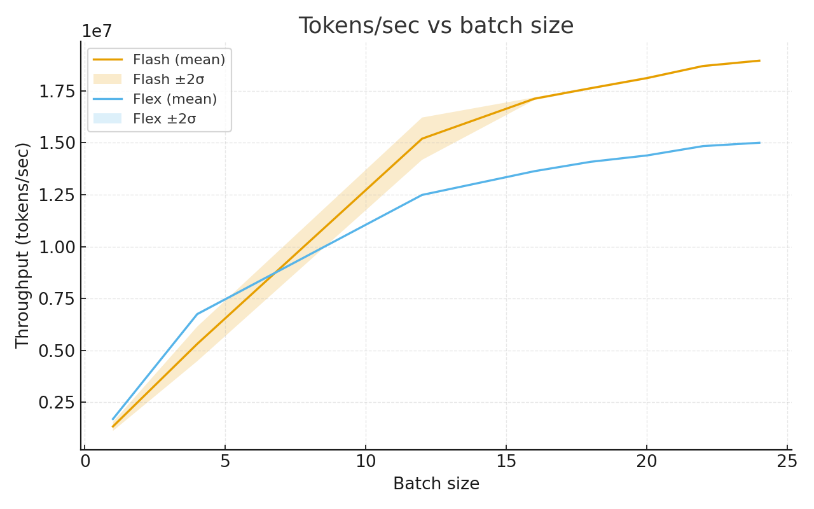

# New record 09/03/25

This submission includes recent WR changes by 
@ClassicLarry [(08/23/25)](https://github.com/ClassicLarry/modded-nanogpt/tree/master/records/082325_SparseAttnGate) 
and @byronxu99 [(07/18/25)](https://github.com/KellerJordan/modded-nanogpt/pull/109). 

Additionally, it has been updated after helpful discussion with @ClassicLarry and @YouJiacheng. 

The main idea of this record is to use [Flash Attention v3](https://github.com/Dao-AILab/flash-attention) instead of Flex Attention. 
The official version of this module is incompatible with `torch.compile` and causes graph breaks. 
However, a [recent PR](https://github.com/Dao-AILab/flash-attention/pull/1769) by 
[@guilhermeleobas](https://github.com/guilhermeleobas) addresses this issue.


## Timing and Validation

Validated over 7 runs:
- In 1695 training steps, this run achieves a loss <3.28 (`p=0.0031`) 
- In 166.10 seconds on average, or <166.25 seconds (`p=0.0024`), 

```
import scipy.stats
import torch
import numpy as np

accs = [
    3.2769, 3.2782, 3.2790, 3.2791, 3.2791, 3.2780, 3.2782
]

times = [
    166.247, 166.117, 165.977, 166.135, 166.045, 166.044, 166.157
]

print('p=%.4f' % scipy.stats.ttest_1samp(accs, 3.28, alternative='less').pvalue)
# p=0.0008

print('p=%.4f' % scipy.stats.ttest_1samp(times, 166.25, alternative='less').pvalue)
# p=0.0024

print(f"{np.mean(times):.4f}")
# 166.1031
```

In my timing, this is a 2.1 second mean improvement over [PR#117])(https://github.com/KellerJordan/modded-nanogpt/pull/117). 
The number of steps can also probably be brought down by 5-15 while achieving loss <3.28.

I used SXM5 8 x H100 via Prime Intellect for validation compute. 

## Further Details

### Motivation

PyTorch's Flex Attention is up to 40% slower than Flash Attention v3. 

As the batch size, e.g. the number of parallel sequences increases, FA3 tends to be increasingly efficient in using SMs. 

In order to train with document masking, we use Flex Attention's `flash_attn_varlen_func`. 
We keep the number of tokens per step fixed (`393216`) but pack a variable number of sequences in each batch.
We clip the maximum length of each sequence to `args.train_max_seq_len = 2048`. 

WR#26 by @ClassicLarry found that validation loss decreases when we train only on sequences beginning with the Beginning of Sequence token (`<BoS>`). 

In order generate batches where each sequence begins with `<BOS>`, I have created the helper class `BOSFinder`. 
This class is useful for generating the start and end of each sequence. 

### Flash Attention 3

Flash Attention 3 is significantly faster than Flex Attention, and this gap increases as we increase the number of sequences per batch:



As mentioned above, we need to use an unmerged PR in order to use FA3 with `torch.compile`. 
You can build the wheel like so:

```
pip install -U pip wheel setuptools ninja numpy packaging psutil

git clone https://github.com/guilhermeleobas/flash-attention.git
cd flash-attention/hopper
git switch guilhermeleobas/fa3-compile

export MAX_JOBS=32                             # Can increase based on machine
export FLASH_ATTENTION_FORCE_BUILD=TRUE        # skip prebuilt wheel fetch
export FLASH_ATTENTION_DISABLE_SM80=TRUE       # Hopper-only
export FLASH_ATTENTION_DISABLE_FP16=TRUE       # leave BF16, FP8
export FLASH_ATTENTION_DISABLE_HDIM64=TRUE     # NanoGPT only uses HDIM = 128
export FLASH_ATTENTION_DISABLE_HDIM96=TRUE
export FLASH_ATTENTION_DISABLE_HDIM192=TRUE
export FLASH_ATTENTION_DISABLE_HDIM256=TRUE

python setup.py bdist_wheel
```

Additionally, I have uploaded a prebuilt wheel [here](https://github.com/varunneal/flash-attention/releases/tag/v3.0.0b1-alpha).
Downloading this wheel and installing it via pip is likely to be fairly fast. 

For exact reproduction, I recommend that you install Torch Nightly 2.9.0.dev20250718 and
install the FA3 wheel afterward:

```
pip install --pre "torch==2.9.0.dev20250718+cu126" --index-url https://download.pytorch.org/whl/nightly/cu126

pip install /path/to/flash_attn_3-3.0.0b1-cp39-abi3-linux_x86_64.whl
```

For me, Torch Nightly 2.9.0.dev20250713 was incompatible with PR#109.

### Attention Masks

Flash Attention exposes the parameter `window_size` where we can specify the number of tokens to attend to.
Unfortunately, it expects this value to be an int, so varying it will cause a `torch.compile` to 
create a new graph. As such, I decreased the number of window sizes over the course of the run. 

I kept the existing long-short sliding window block mask pattern, as well as the idea
that the window sizes should linearly increase over the length of the training run.
To aid with this, I created a hyperparameter `ws_schedule` and `get_ws(step)`.
I additionally added the size of blocks in a window as a hyperparameter `block_size=128`. 

I have picked a linear schedule with three steps: `ws_schedule=(3, 7, 11)`. 
Each graph needs to be warmed up separately. I have increased the number 
of warmup steps from `10` to `30`. The compile time is dominated by the first iteration
so this will take approximately `len(ws_schedule)` times longer than before.


Document masks are implemented by specifying the start and end of each sequence in `cu_seqlens_*`. 
In order for the tensor sizes to be fixed, we pad `cu_seqlens_*` to be a fixed length of a length larger
than the number of documents we may ever expect in a single input batch.
At training time, sequences are clipped to `args.max_seq_len` tokens. 

### Potential Improvements

- Batch size scheduling: Previously, the block mask acted as a proxy for batch size.
Now block size can be controlled explicitly and sequenced according to critical batch
size theory. I have added code in `distributed_data_generator` that allows for changing the 
batch size and max sequence length yielded after the generator is created. 
- The current block mask window schedule `(3, 7, 11)` can almost certainly  be improved upon.
- Hyperparameter tuning might change with smaller sequence length. Rotary base, validation sequence length, learning rates 
etc. should be re-tuned. I haven't done that for this run. 
